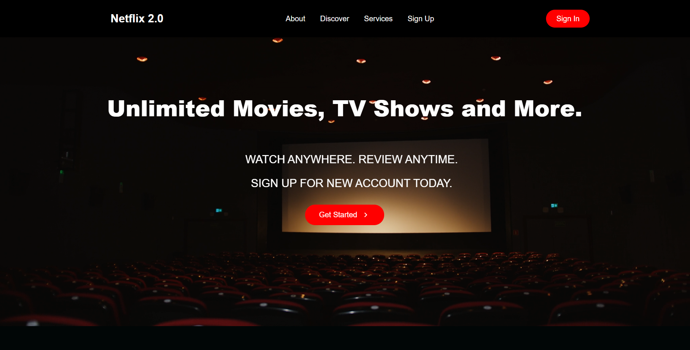
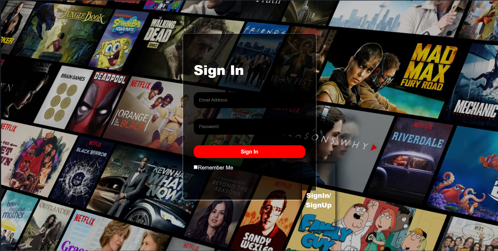

# Database-Project
Front and Back End Developing

1- To begin with, open the files in your IDE of your choice. We will be using VSCode in this tutorial.

2- For react applicants, create react app using npx create-react-app web.

3- Then shift to the client folder by cd client using terminal.

4- Then in the terminal, write npm start right after shifting to the client folder.

5- Once the website has loaded, log in to it using your creditials.

6- Once the websitehas loaded, come to the VSCode and open another terminal.

7- Then shift to the server folder by cd server using the other terminal.

8- To process the server, install npm express body-parser mysql then npm install nodemon u.

9- For passing data to the mysql database, install npm  axios and npm install cors.

10- And finally start the server by npm run devStart.

11- Finally all working on th frontend is being showed on the database server

